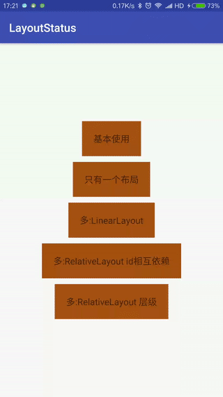

# LayoutStatusControl

一个用于设置Layout不同状态的class



## 优点

 * 使用非常简单,方便
 * 无需修改已经写好的xml布局(对半路要求新增样式的项目尤其有用)
 * 不会加深UI的层级,从而导致过度绘制,卡顿等问题
 * 可以自定义自己的布局样式
 * 可对布局样式设置监听
 * 可对任何View设置,不仅局限于ListView or RecycleView
 * 自动继承被替换的View的属性,包括大小,位置,id(注意监听问题)等.
 * 不会破坏被替换的View与其他View之间的依赖关系.(特别是相对布局)

## 背景
当为ListView设置一个空数据样式时,一般这么做:

```xml
<LinearLayout>
    <ListView
        android:id="@+id/list_sms_history"
        android:layout_width="fill_parent"
        android:layout_height="fill_parent"
        android:scrollingCache="false" />
    <TextView
        android:id="@+id/noSmsData"
        android:layout_width="match_parent"
        android:layout_height="wrap_content"
        android:gravity="center_vertical|center_horizontal"
        android:text="暂无数据" />
</LinearLayout>
```

```java
callLogList = (ListView)findViewById(R.id.call_log_list);
myEmpty=(TextView)findViewById(R.id.myEmptyText);
callLogList.setEmptyView(myEmpty);
```

如果要为RecycleView设置一个空数据样式时,会更加复杂.<br>
我们必须修改xml文件和java代码,让view可见与不可见.<br>
如果项目一开始没有对每个布局设置好空数据样式时,现在就需要对许多文件进行设置,这可能会让我们抓狂.<br>

更加糟糕的是,现在需求改了,可能空数据的样式不好看,需要换一个样式,我们可能要检查每一个布局.<br>
虽然空数据的layout可能是统一的,但是有的xml布局可能特别复杂,以至于我们不得不检查每一个修改的文件.<br>
而且此时还可能会新增正在加载,错误等样式,这更加复杂...

LayoutStatusControl 能很好的帮助我们设置一个空数据样式,甚至是其他的样式,而且它非常的简单,方便.<br>
修改样式也特别的方便,而且它无需修改原有的xml,不会加深布局的层级导致UI过度绘制,卡顿问题....

那么niubility,还不赶紧来试试.

## 使用方法

### 快速使用

```java
//第一步:初始化,设置你想要替换的view的id
lyControl = new LayoutStatusControl(this, R.id.tv_content);
//第二步:设置一个空数据样式.你可以设置一个layout或一个view
lyControl.setEmptyView(R.layout.view_nodata);
//第三步:展示
lyControl.showEmptyView();
```

### 更多功能

设置正在加载,空数据,加载错误,以及加载成功样式

```java
lyControl.showLoadingView();
lyControl.showEmptyView();
lyControl.showErrorView();
lyControl.showSuccessView();
```

自定义样式界面

```java
lyControl.setEmptyView();
lyControl.setErrorView();
lyControl.setLoadingView();
```

对界面设置监听

```java
lyControl.setEmptyListener();
lyControl.setErrorListener();
```

更多使用方法,可以看这个例子[Example](./app/src/main/java/com/siyehua/layoutstatus/Main1Activity.java)

## 问题
如果你有任何问题,你可以通过 [GitHub Issues](https://github.com/siyehua/LayoutStatus/issues)提交.

## LICENSE
```
Copyright 2017 The LayoutStatusControl authors

Licensed under the Apache License, Version 2.0 (the "License");
you may not use this file except in compliance with the License.
You may obtain a copy of the License at

    http://www.apache.org/licenses/LICENSE-2.0

Unless required by applicable law or agreed to in writing, software
distributed under the License is distributed on an "AS IS" BASIS,
WITHOUT WARRANTIES OR CONDITIONS OF ANY KIND, either express or implied.
See the License for the specific language governing permissions and
limitations under the License.
```