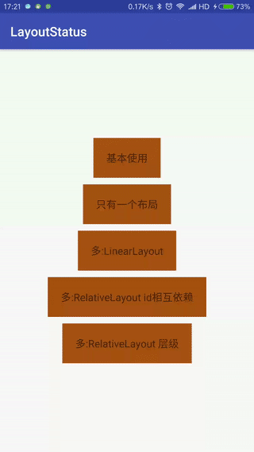

# LayoutStatusControl

[中文文档](./readmech.md)

A class used for control Layout status.



## Features

 * quickly,convenient
 * not need to modify xml
 * not deepen the UI level,lead to over-drawing and dropped frames
 * can custom layout
 * can set listener
 * can use any View,not only limited to ListView or RecycleView
 * auto get layout params from replaced View,eg: size, position, id and so on
 * does not destroy the dependencies between the replaced View and other View (especially the relative layout)

## BackGround
If you want to set a empty View in your ListView, you can do this:

```xml
<LinearLayout>
    <ListView
        android:id="@+id/list_sms_history"
        android:layout_width="fill_parent"
        android:layout_height="fill_parent"
        android:scrollingCache="false" />
    <TextView
        android:id="@+id/noSmsData"
        android:layout_width="match_parent"
        android:layout_height="wrap_content"
        android:gravity="center_vertical|center_horizontal"
        android:text="暂无数据" />
</LinearLayout>
```

```java
callLogList = (ListView)findViewById(R.id.call_log_list);
myEmpty=(TextView)findViewById(R.id.myEmptyText);
callLogList.setEmptyView(myEmpty);
```

If you want to set a empty View in your RecycleView, you must write more code.<br>
We should set emptyView or set View's visible or gone in xml or java file.<br>
And we will mad when we set thousands of empty Views. Because we didn't do it at the beginning of the project.<br>
This is not the worst, if producter or designer want to add loading and error View, and change the empty View,<br>
The UI is so complex that you should fix xml and code one bye one.

The LayoutStatusControl can help you set a empty View quickly and convenient.

## Sample usage

### Use it quickly

```java
//1: init class. R.id.tv_content is the View's id which you want to replace
lyControl = new LayoutStatusControl(this, R.id.tv_content);
//2: set empty View, parameter is layout id or a View
lyControl.setEmptyView(R.layout.View_nodata);
//3: show
lyControl.showEmptyView();
```

### More features

show loading, empty, error or success View

```java
lyControl.showLoadingView();
lyControl.showEmptyView();
lyControl.showErrorView();
lyControl.showSuccessView();
```

custom status View

```java
lyControl.setEmptyView();
lyControl.setErrorView();
lyControl.setLoadingView();
```

set click listener

```java
lyControl.setEmptyListener();
lyControl.setErrorListener();
```

More info, you can see this [Example](./app/src/main/java/com/siyehua/layoutstatus/Main1Activity.java)

## Bugs
For bugs, feature requests, and discussion please use [GitHub Issues](./issues).

## LICENSE
```
Copyright 2017 The LayoutStatusControl authors

Licensed under the Apache License, Version 2.0 (the "License");
you may not use this file except in compliance with the License.
You may obtain a copy of the License at

    http://www.apache.org/licenses/LICENSE-2.0

Unless required by applicable law or agreed to in writing, software
distributed under the License is distributed on an "AS IS" BASIS,
WITHOUT WARRANTIES OR CONDITIONS OF ANY KIND, either express or implied.
See the License for the specific language governing permissions and
limitations under the License.
```